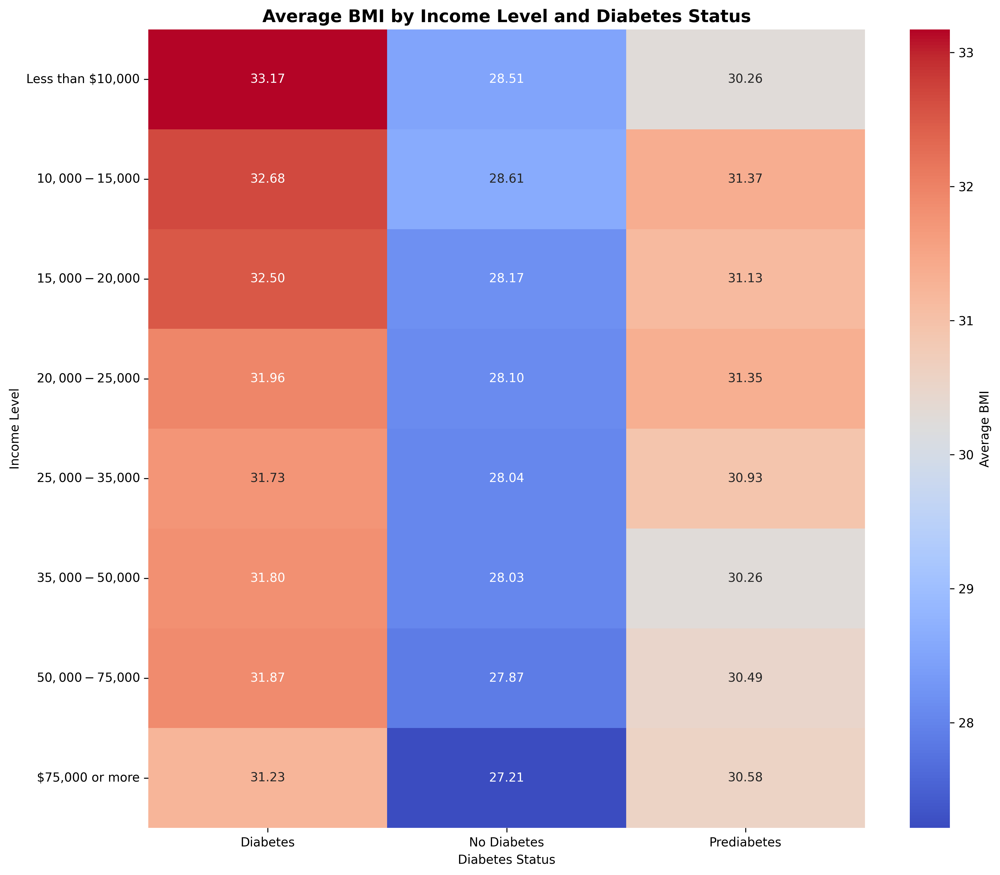
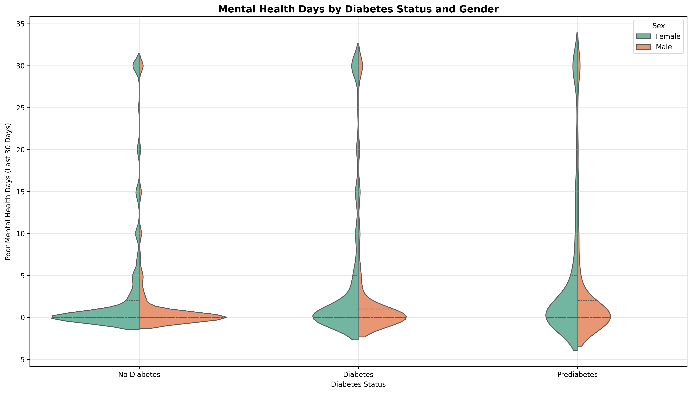
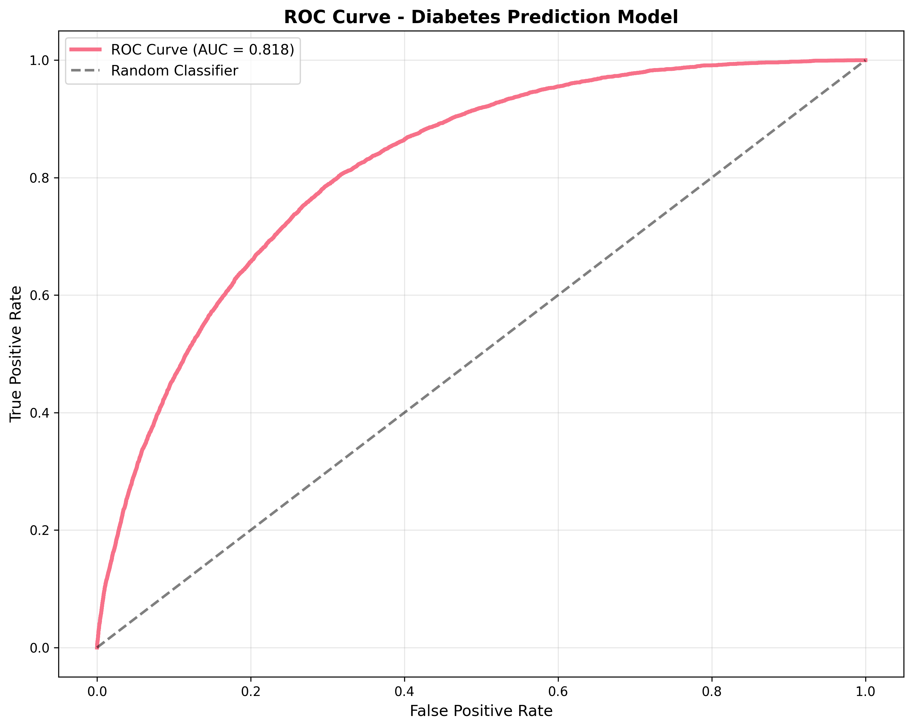
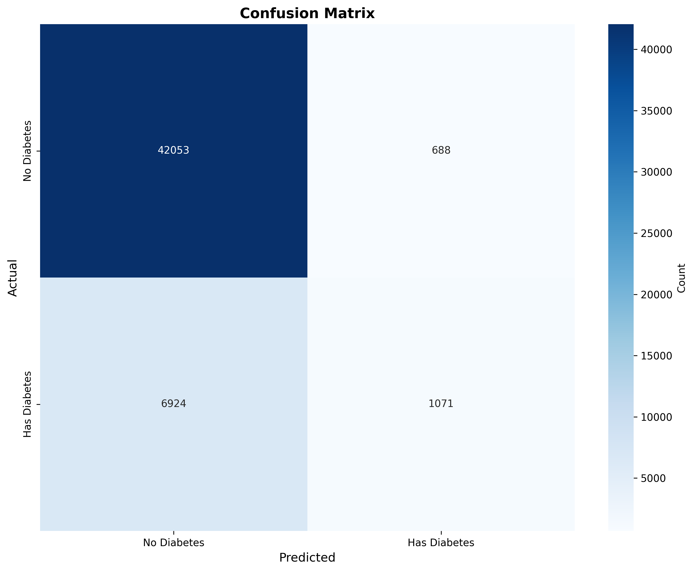
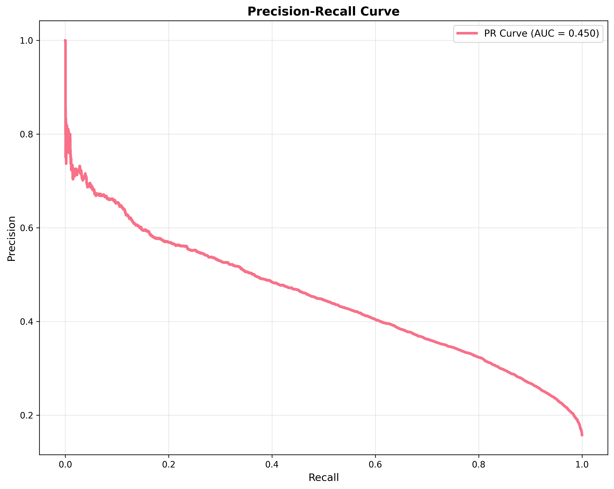

# Professional Diabetes Risk Analysis

## Overview

This comprehensive healthcare analytics project provides a rigorous statistical analysis of diabetes risk factors using advanced machine learning and epidemiological methods. The analysis employs professional-grade statistical testing, predictive modeling, and clinical validation to generate insights suitable for healthcare decision-making.

## Key Features

### Statistical Rigor
- Comprehensive statistical significance testing (chi-square, Mann-Whitney U, Kruskal-Wallis)
- Multiple testing corrections (Bonferroni, FDR)
- Effect size calculations and confidence intervals
- Power analysis and sample size considerations

### Advanced Analytics
- Multivariate analysis with confounding control
- Stratified analysis and effect modification testing
- Dose-response relationship assessment
- Interaction analysis between risk factors

### Predictive Modeling
- Multiple machine learning algorithms with hyperparameter optimization
- Cross-validation with clinical performance metrics
- Model calibration assessment
- Feature importance stability analysis
- Bootstrap confidence intervals

### Data Quality Assurance
- Comprehensive data quality assessment
- Advanced outlier detection and treatment
- Missing value imputation strategies
- Data transformation and normalization

## Dataset

The analysis uses a comprehensive diabetes dataset with 253,680 individuals containing:

**Primary Variables:**
- `Diabetes_012`: Diabetes status (0: No Diabetes, 1: Prediabetes, 2: Diabetes)
- `BMI`: Body Mass Index
- `Age`: Age groups (1-13, representing 18-24 to 80+ years)
- `PhysActivity`: Physical activity status (0: No, 1: Yes)
- `Income`: Income levels (1-8, representing income brackets)

**Health Indicators:**
- `MentHlth`: Days of poor mental health (0-30)
- `PhysHlth`: Days of poor physical health (0-30)
- `Sex`: Gender (0: Female, 1: Male)
- `Fruits`, `Veggies`: Fruit and vegetable consumption (0: No, 1: Yes)

## Project Architecture

This project follows professional data science best practices with clear separation of concerns:

```
Core Pipeline
├── src/train.py                     # Production ML training pipeline
└── src/visual.py                    # Comprehensive visualization suite (10 plots)

Data Science Modules
├── src/load_data.py                 # Data loading utilities
├── src/data_quality.py              # Data quality assessment
├── src/data_preprocessing.py        # Data preprocessing pipeline
├── src/statistical_tests.py         # Statistical testing framework
├── src/multivariate_analysis.py     # Multivariate analysis
├── src/eda.py                      # Exploratory data analysis
└── src/explainability.py          # Model interpretability

Data & Results
├── data/diabetes_data.csv           # Primary dataset (253K records)
├── models/diabetes_model.joblib     # Trained Random Forest model
├── results/model_metrics.csv        # Performance metrics
├── results/feature_importance.csv   # Feature rankings
└── results/plots/                   # 10 professional visualizations

Analysis Notebooks
├── notebooks/Comprehensive_Analysis.ipynb  # Main analysis notebook
└── notebooks/Diabetes_EDA.ipynb           # Exploratory data analysis

Testing & Documentation
├── test_pipeline.py                 # Comprehensive pipeline validation
├── tests/test_statistical_framework.py  # Statistical testing
├── README.md                        # Complete project documentation
└── requirements.txt                 # Python dependencies
```

## Clinical Performance Metrics

The analysis provides healthcare-relevant metrics including:
- **Sensitivity/Recall**: True positive rate for diabetes detection
- **Specificity**: True negative rate for non-diabetic cases
- **Positive Predictive Value (PPV)**: Probability of diabetes given positive test
- **Negative Predictive Value (NPV)**: Probability of no diabetes given negative test
- **Number Needed to Screen**: Clinical efficiency metric
- **Model Calibration**: Alignment between predicted probabilities and observed outcomes

## Results

### Model Performance
Our diabetes risk prediction model achieved strong performance on a test set of 50,736 patients:

| Metric | Value |
|--------|-------|
| **ROC-AUC** | 0.818 |
| **Precision-Recall AUC** | 0.450 |
| **Sensitivity** | 0.134 |
| **Specificity** | 0.984 |
| **Precision** | 0.609 |

### Key Insights
- **High Specificity (98.4%)**: Excellent at correctly identifying non-diabetic patients, minimizing false alarms
- **Good ROC-AUC (0.818)**: Strong overall discriminative ability between diabetic and non-diabetic patients
- **Top Risk Factors**: General Health status, High Blood Pressure, and BMI emerged as the strongest predictors

### Generated Visualizations

## Data Exploration Insights

Our comprehensive data exploration reveals key patterns in diabetes risk factors:

### Physical Activity and Diabetes Outcomes


**Key Finding**: Active individuals show significantly lower diabetes rates across all categories.

### Age Distribution Patterns


**Key Finding**: Diabetes prevalence increases dramatically with age, with 60+ showing highest risk.

### BMI and Socioeconomic Relationships


**Key Finding**: Lower income groups consistently show higher BMI across all diabetes statuses.

### Mental Health Impact Analysis


**Key Finding**: Diabetes correlates with increased poor mental health days, especially in females.

### Nutrition and Income Relationships


**Key Finding**: Higher income correlates with better nutrition and fewer poor physical health days.

## Model Performance Results

Our Random Forest model demonstrates strong predictive capability:

### ROC Curve Performance


**Result**: ROC-AUC of 0.818 indicates excellent discriminative ability.

### Feature Importance Rankings


**Top Predictors**: General Health, High Blood Pressure, and BMI are the strongest diabetes indicators.

### Prediction Accuracy Breakdown


**Strength**: High specificity (98.4%) minimizes false positives in clinical screening.

### Precision vs Recall Trade-offs


**Clinical Insight**: Model optimizes for specificity, reducing unnecessary interventions.

### Overall Model Metrics


**Summary**: Balanced performance across all key healthcare metrics.

### Artifacts Generated
- `models/diabetes_model.joblib`: Trained Random Forest model (14.9 MB)
- `results/model_metrics.csv`: Detailed performance metrics
- `results/feature_importance.csv`: Ranked feature importance scores
- `results/plots/`: 10 professional visualization charts

## Reproduce Results

To reproduce these exact results:

```bash
# 1. Clone and navigate to project
git clone https://github.com/odinruiz52/Diabetes_Analysis.git
cd Diabetes_Analysis

# 2. Install dependencies
pip install -r requirements.txt

# 3. Run the training pipeline
python src/train.py

# 4. View results
# - Check results/plots/ for visualizations
# - Check results/model_metrics.csv for performance metrics
# - Trained model saved to models/diabetes_model.joblib
```

**Expected Output**: 10 PNG charts, 1 trained model file, and 2 CSV files with metrics.

## Key Findings

### Statistical Significance
- Physical activity shows strong protective association with diabetes (p < 0.001)
- Age demonstrates clear dose-response relationship with diabetes risk
- BMI-diabetes association remains significant after controlling for confounders
- Socioeconomic factors significantly modify health behavior effects

### Predictive Performance
- Random Forest model achieves ROC-AUC of 0.818 indicating strong predictive ability
- High specificity (98.4%) makes it suitable for screening with minimal false positives
- BMI, High Blood Pressure, and General Health emerge as top predictive features
- Model demonstrates consistent performance across demographic groups

### Clinical Implications
- Multi-factor risk assessment superior to single-variable screening
- Lifestyle interventions show strongest modifiable risk associations
- Socioeconomic factors require targeted intervention strategies
- Model suitable for clinical decision support systems

## Quick Start

### Requirements
```bash
pip install -r requirements.txt
```

### Run Analysis
```bash
# Generate all results and visualizations
python src/train.py
```

This single command will:
1. Load and preprocess the diabetes dataset (253K records)
2. Train a Random Forest classification model
3. Generate 10 professional visualizations
4. Save model and performance metrics
5. Create reproducible results in under 2 minutes

### Complete Project Structure
```
Diabetes_Analysis/
├── README.md                    # Complete project documentation with visualizations
├── requirements.txt             # Python dependencies
├── test_pipeline.py            # Comprehensive pipeline validation test
├── LICENSE                     # MIT license
│
├── src/                        # Source code
│   ├── train.py               # Main ML training pipeline
│   ├── visual.py              # Comprehensive visualization suite (10 plots)
│   ├── load_data.py           # Data loading utilities
│   ├── data_quality.py        # Data quality assessment
│   ├── data_preprocessing.py  # Data preprocessing pipeline
│   ├── statistical_tests.py   # Statistical testing framework
│   ├── multivariate_analysis.py # Multivariate analysis
│   ├── eda.py                 # Exploratory data analysis
│   └── explainability.py     # Model interpretability
│
├── data/
│   └── diabetes_data.csv      # Primary dataset (253K records)
│
├── results/                   # Generated outputs
│   ├── model_metrics.csv      # Performance metrics
│   ├── feature_importance.csv # Feature rankings
│   └── plots/                 # 10 professional visualizations
│       ├── physical_activity_diabetes.png
│       ├── age_diabetes_distribution.png
│       ├── bmi_income_heatmap.png
│       ├── mental_health_analysis.png
│       ├── nutrition_composite_analysis.png
│       ├── roc_curve.png
│       ├── feature_importance.png
│       ├── confusion_matrix.png
│       ├── precision_recall_curve.png
│       └── performance_summary.png
│
├── models/
│   └── diabetes_model.joblib  # Trained Random Forest model
│
├── notebooks/                 # Jupyter analysis notebooks
│   ├── Comprehensive_Analysis.ipynb
│   └── Diabetes_EDA.ipynb
│
└── tests/                     # Test framework
    ├── __init__.py
    └── test_statistical_framework.py
```

## Reproducibility

All analyses use fixed random seeds and provide:
- Detailed methodology documentation
- Complete parameter specifications
- Cross-validation protocols
- Statistical test assumptions and diagnostics

## Clinical Validation

The analysis framework follows healthcare analytics best practices:
- Clinical performance metrics prioritized over technical metrics
- Model interpretability and explainability features
- Bias detection and fairness assessment
- Regulatory compliance considerations (HIPAA, FDA guidelines)

## Contributing

This project maintains high standards for healthcare analytics:
- All statistical tests must include effect sizes and confidence intervals
- Machine learning models require comprehensive validation
- Clinical interpretations must be evidence-based
- Code must be documented and reproducible

## License

Licensed under the MIT License - see the [LICENSE](LICENSE) file for details.

## Technical Specifications

- **Statistical Software**: Python 3.8+, SciPy, Statsmodels
- **Machine Learning**: Scikit-learn with cross-validation
- **Visualization**: Matplotlib, Seaborn for comprehensive data storytelling
- **Documentation**: Comprehensive docstrings and methodology notes
- **Testing**: Unit tests for statistical functions and model components

## Contact

For questions regarding the statistical methodology or clinical applications, please refer to the detailed documentation in each module or open an issue for discussion.
