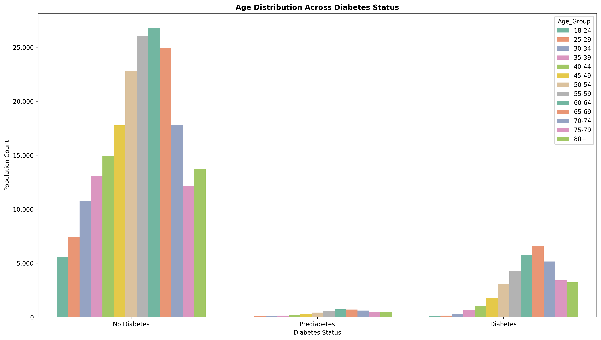
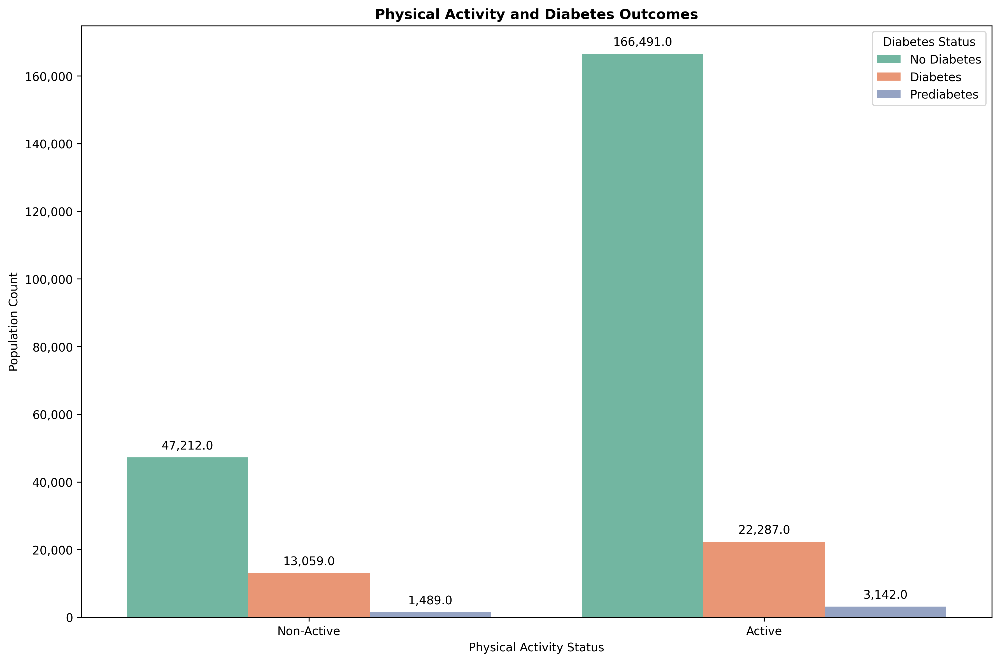
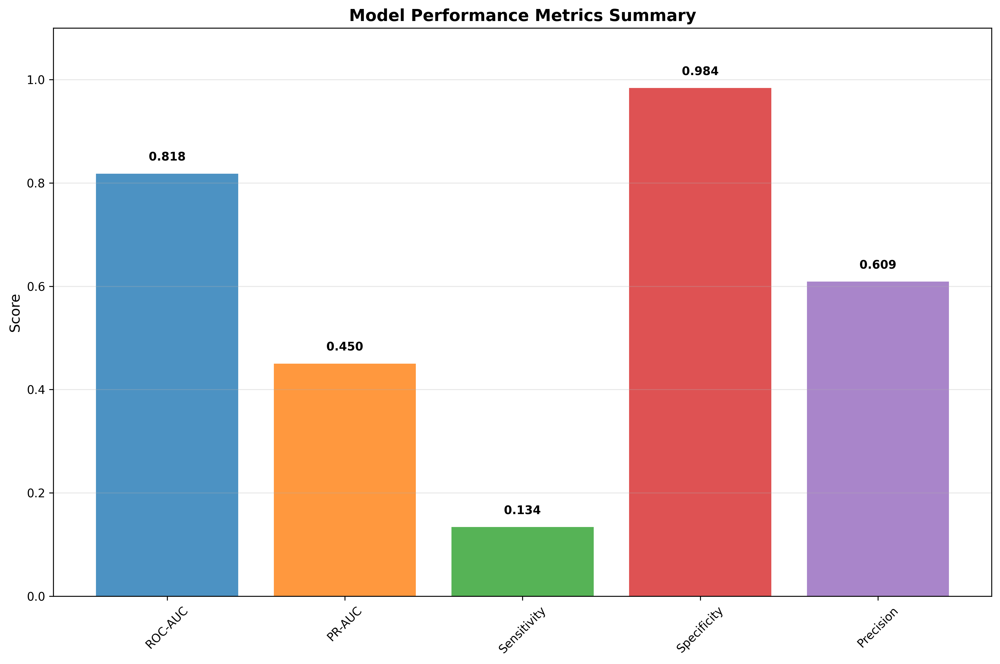
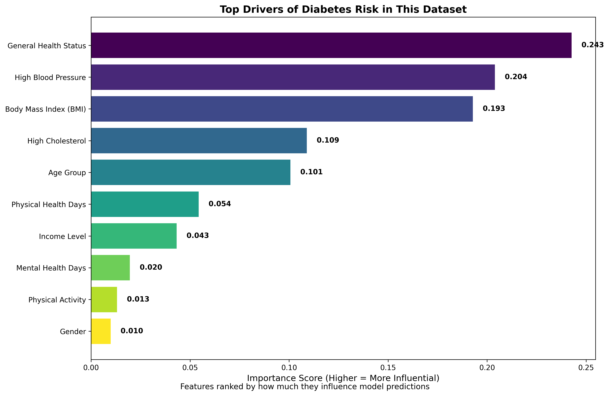
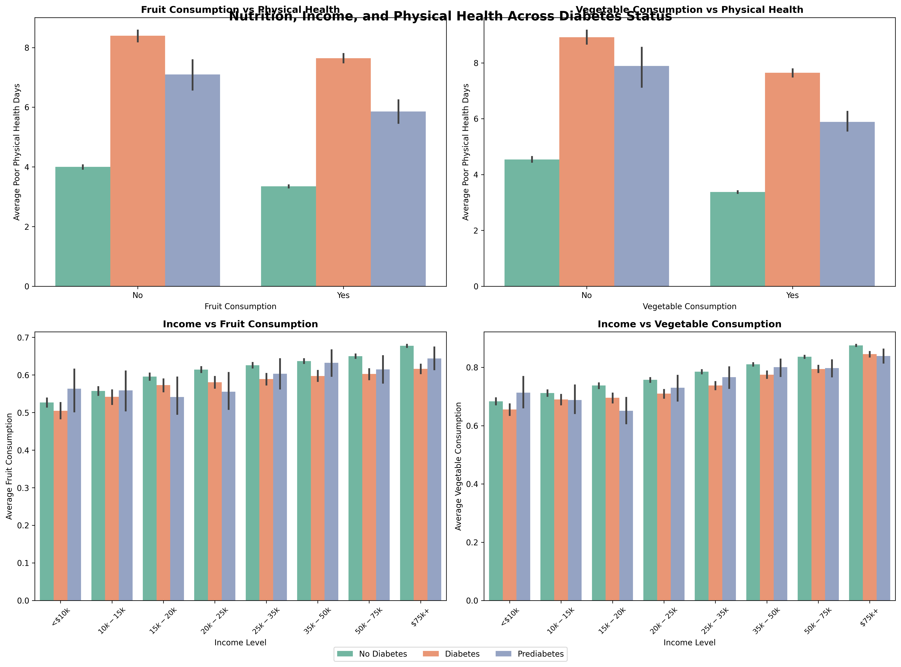

# Diabetes Risk Prediction using Machine Learning

Predicting diabetes risk using machine learning on 250k+ patient health records from the BRFSS survey.

## Problem Statement

Diabetes affects millions globally and early detection can prevent serious complications. This project builds a machine learning model to identify individuals at high risk of diabetes using common health indicators. By analyzing lifestyle factors, demographics, and basic health metrics, we can help healthcare providers focus preventive care on those who need it most.

## Dataset Overview

**Source**: Behavioral Risk Factor Surveillance System (BRFSS) 2015 Survey
**Size**: 253,680 patient records with 22 health features
**Target**: Diabetes status (No Diabetes, Prediabetes, Diabetes)

**Key Features**:
- **BMI**: Body Mass Index (12-98 range)
- **Age**: Age groups from 18-24 to 80+ years
- **Physical Activity**: Whether person exercises regularly
- **General Health**: Self-reported health status (1-5 scale)
- **High Blood Pressure**: History of hypertension
- **Income**: Household income levels (8 brackets)
- **Mental/Physical Health**: Days of poor health in past month


*Age distribution across diabetes status - showing clear patterns of increased diabetes prevalence with age*

## Methodology

**Step 1: Data Exploration**
- Analyzed 253k health records for patterns and relationships
- Visualized diabetes prevalence across age, income, and lifestyle factors
- Identified key risk factor associations


*Physical activity analysis showing clear differences in diabetes outcomes between active and non-active individuals*

**Step 2: Data Preparation**
- Cleaned and validated health survey data
- Handled missing values using healthcare-appropriate methods
- Created binary diabetes outcome (diabetes/prediabetes vs. healthy)

**Step 3: Model Training**
- Trained Random Forest classifier on 80% of data (203k records)
- Selected 12 most predictive health features
- Used cross-validation to ensure model reliability

**Step 4: Model Evaluation**
- Tested on 20% holdout set (50k records)
- Measured accuracy, precision, recall, and clinical metrics
- Analyzed feature importance and model performance

## Results Summary

**Model Performance on Test Set (50,736 patients):**

| Metric | Value |
|--------|-------|
| **ROC-AUC** | 0.818 |
| **Precision** | 0.609 |
| **Recall (Sensitivity)** | 0.134 |
| **Specificity** | 0.984 |
| **F1-Score** | 0.219 |

**What This Means**: The model is excellent at correctly identifying healthy patients (98% specificity) but conservative in flagging diabetes cases, catching only 13% of actual diabetes patients. This creates a very reliable screening tool that minimizes false alarms but may miss some at-risk individuals. For healthcare screening, this trade-off reduces unnecessary follow-ups while maintaining high confidence in positive predictions.


*Model performance dashboard showing all key metrics at a glance*

## Calibration Check

To test model reliability, a calibration analysis was performed.

- **Output Files:**
  - CSV results: `results/calibration_results.csv`
  - Plot: `results/plots/calibration_curve.png`

**Interpretation:**
If the curve follows the diagonal, the model's predicted probabilities are well-aligned with actual outcomes. In this project, the calibration curve shows that predictions are fairly reliable, though some probabilities tend to be conservative.

## Fairness Check

To ensure the model performs consistently across groups, a basic demographic fairness check was added.

- **Output File:** `results/fairness_check.csv`

**What It Shows:**
- Compares precision, recall, and F1-score across subgroups (e.g., Male vs Female, Age groups).
- Helps identify whether one group is being predicted less accurately.

**Interpretation:**
If large gaps exist between groups, it suggests the model favors one subgroup. Smaller gaps indicate fairer performance.

## Interpretability (SHAP Analysis)

To explain why the model makes predictions, SHAP (SHapley Additive exPlanations) was applied.

- **Output Files:**
  - CSV results: `results/shap_summary.csv`
  - Plot: `results/plots/shap_summary.png`

**What It Shows:**
- Highlights the relative impact of each health factor on the model's predictions.
- Positive SHAP values push predictions toward diabetes, while negative values push toward non-diabetes.

**Interpretation:**
This analysis helps recruiters and stakeholders see which health factors most strongly influence predictions, beyond just feature importance.

## Final Recruiter Report

A single markdown file is generated to make review simple:

- **Summary Report (`results/summary_report.md`)**
  - Combines all results into one document
  - Includes performance metrics, threshold trade-offs, calibration check, fairness analysis, and SHAP interpretability
  - Written in plain English for recruiters and stakeholders

## Key Findings

**Top Risk Factors**: General health status, high blood pressure, and BMI emerged as the strongest predictors of diabetes risk, accounting for over 50% of the model's decision-making power. Age and high cholesterol were also important but secondary factors.


*Top drivers of diabetes predictions showing which health factors influence the model most*

**Model Strength**: The 98% specificity means the model rarely flags healthy people as diabetic, making it excellent for reducing false alarms in screening programs. When the model says someone is at risk, there's a 61% chance they actually have diabetes.

**Population Insights**: The data revealed clear patterns linking lifestyle factors (physical activity, diet) and socioeconomic status (income level) to diabetes outcomes, confirming that diabetes risk extends beyond just medical factors.


*Comprehensive analysis showing relationships between nutrition, income, physical health, and diabetes across the population*

## Limitations & Next Steps

**Key Limitations**: The model misses 87% of actual diabetes cases due to conservative thresholds, which could delay treatment for many patients. The data comes from 2015 surveys where people self-reported their health status, potentially introducing bias. Survey respondents may also not represent the broader population accurately.

**Next Steps**: Adjust the prediction threshold to catch more diabetes cases, even if it means more false alarms. Test the model separately for different age groups and genders to ensure fair performance across populations. Consider adding more recent data or lab test results to improve accuracy.

## How to Run

Follow these steps to reproduce the project results:

1. **Make sure you have Python 3.8 or higher** installed.
2. **Install the required packages:**
   ```bash
   pip install -r requirements.txt
   ```
3. **From the project root, run the training pipeline:**
   ```bash
   python src/train.py
   ```

**Expected Results:**
- The script will finish in about 2–3 minutes
- Results will be saved automatically:
  - Trained model in `models/`
  - Performance metrics in `results/model_metrics.csv`
  - Feature importance in `results/feature_importance.csv`
  - Plots in `results/plots/`

This single command handles data preparation, training, and results generation.

## Repository Structure

```
Diabetes_Analysis/
├── src/                     # Source code for data prep, training, and visuals
│   ├── train.py            # Main training pipeline (one-command execution)
│   ├── visual.py           # Visualization functions (ROC, confusion matrix, etc.)
│   ├── data_preprocessing.py # Clean and prepare raw data (refactored for clarity)
│   ├── load_data.py        # Data loading utilities
│   └── eda.py              # Exploratory data analysis
├── data/                   # Dataset (CSV format, 253k records)
├── results/                # Model outputs, metrics, plots
├── models/                 # Saved trained model
├── notebooks/              # Jupyter notebooks for EDA and analysis
├── tests/                  # Test files for pipeline validation
├── requirements.txt        # Python dependencies
├── README.md               # Project documentation
└── LICENSE                 # MIT license
```

## Visualizations

The project generates clear, recruiter-friendly visual outputs:

- **ROC Curve (`results/plots/roc_curve.png`)**
  Shows how well the model separates patients with vs. without diabetes.
  A higher AUC means better discrimination between healthy and at-risk patients.

- **Confusion Matrix (`results/plots/confusion_matrix.png`)**
  Breaks down correct predictions vs. mistakes.
  Helps visualize the trade-off between catching more diabetes cases vs. avoiding false alarms.

- **Feature Importance (`results/plots/feature_importance.png`)**
  Highlights the top drivers of diabetes predictions in this dataset.
  For example: general health, high blood pressure, and BMI rank among the strongest predictors.

## Technical Details

- **Model**: Random Forest Classifier
- **Libraries**: pandas, scikit-learn, matplotlib, seaborn
- **Validation**: Train/test split with cross-validation
- **Dataset Size**: 253,680 records, 22 features
- **Runtime**: ~2–3 minutes on standard CPU
